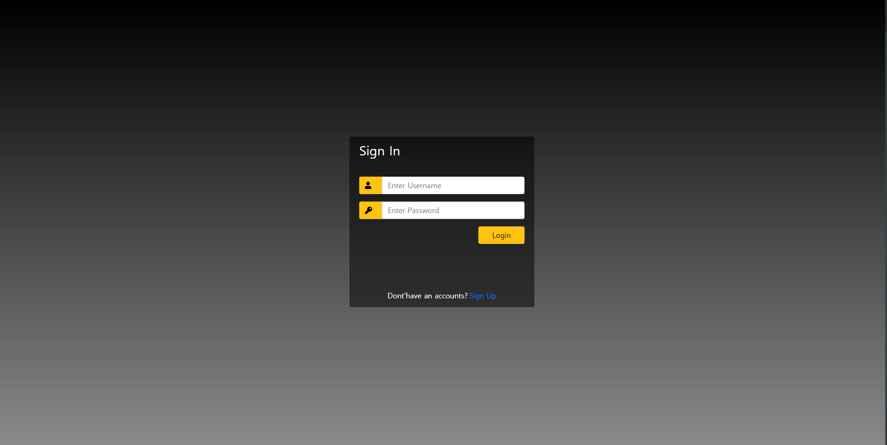
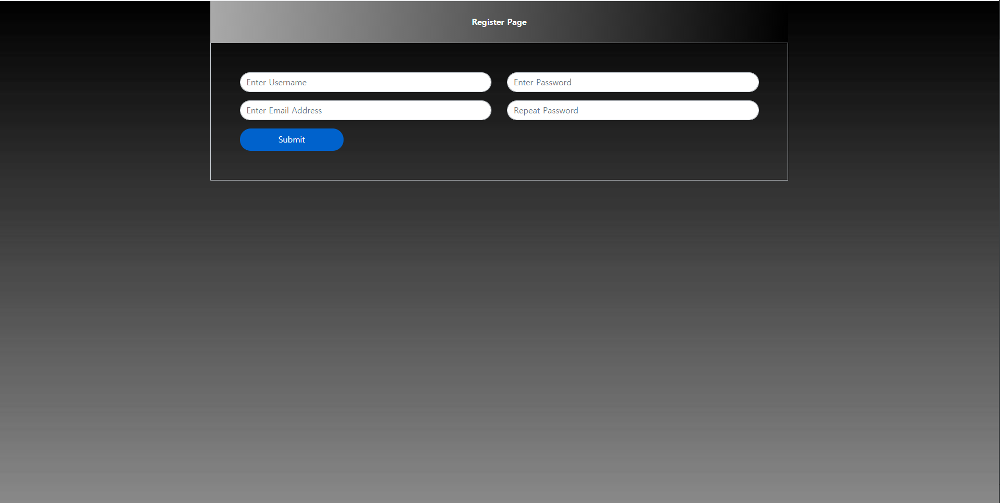
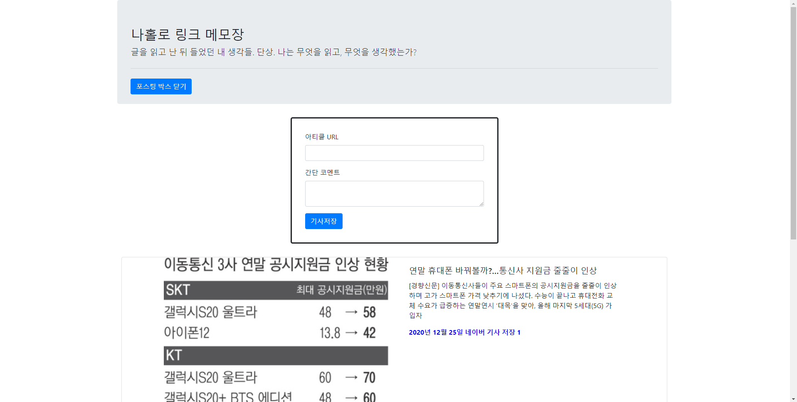

# article_log
## ID와 Password를 입력하고 스크랩한 기사들을 보거나, 추가하는 나홀로 메모장

- Python, Flask, Flask-Login, Flask-Session, sqlite를 이용한 나홀로 메모장
- 구조
	- Controller - 비즈니스 로직을 처리하는 뷰 함수가 구현된 컨트롤러 모듈이 있는 패키지
		- login_page - 로그인을 처리하는 모듈
		- register - 회원등록을 처리하는 모듈
		- view_page - 스크랩한 기사들을 보여주는 모듈
	- model - Database를 처리하는 모듈
		- database - sqlite를 연결하는 모듈
		- article - 기사를 저장하는 테이블을 만들고, 처리하는 모듈
		- forms - 로그인, 회원가입 wtform을 제공하는 모듈
		- user - User를 저장하는 테이블을 만들고, 처리하는 모듈
	- resource - 로그 파일들과 sqlite 데이터베이스의 파일이 있는 파일
            - static - CSS 및 자바스크립트 파일이 있는 폴더
            - templates - HTML 파일이 있는 폴더
- 로그인 페이지

- 회원가입 페이지

- 메모장 페이지
